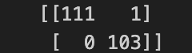
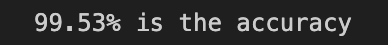
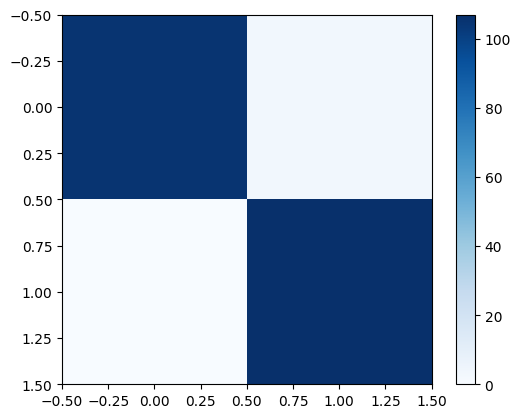

# Cancer Classifier Model

## How to Use
Run the file named '''script.py'''. You can run this via the command '''python3 script.py''' in the terminal. The program will run and ask you the questions required to produce the diagnoses. After answering the questions whether the cancer is begign or malignant will be printed out in a user friendly way.

## How does it work
The file named '''model.ipynb''' creates a model and trains it using the csv file. After the model is trained, it is tested and the accuracy is printed out, the model is then saved and is named '''classifier.pk1'''. However, the model is already saved and is ready to use. 

When the script is run, we are asked the questions that is required as an input by the model and our answers are provided to the model in form of a 2 Dimensional array. The saved model is used and the output of the model is printed out in a user friendly way which tells the user whether the cancer was benign or malignant. 

## Model.ipynb 
First the libraries that are required are imported. Some of these libraries include:
1. Pandas: Used to manipulate data
2. Matplotlib: To create graphs, diagrams to visualize the accuracy of the model.
3. sklearn: To split the data into training data, testing data and to get the accuracy of the model. 
4. os: To import the csv file.
5. imblearn: To prevent overfitting of the data. 
6. joblib: To save the model. 
7. xgboost: To get the model and make the classifier. 

### Data preprocessing
The csv file is first loaded using the os library and is stored under the variable name '''path'''. Pandas is then used to read the csv file and the copy of the csv file is stored under the variable name '''dataset''' and all the data manipulations will be done on this copy so that the actual csv file is not affected. The data preprocessing now starts. The column 'id' is deleted because the patient id is not related to the type of cancer the patient may have. The dataset is then split into dependent and independent variables. '''x''' is the dependent variable which denotes all the characteristics of the cancer cells, and '''y''' is the independent variable which denotes whether the cancer is benign or malignant. The independent variable contains alphapetic or categorical information, we need to convert this information into numbers, a form which is understood by the model. We use the class called LabelEncoder for this. Label encoder converts the categorical data of the independent variable of '''M''' or '''B''' into '''0''' and '''1'''. After this, an object of the class RandomOverSampler is made. This will resample the data to prevent overfitting of the data and bias towards one particular outcome. The resampler trains the model by providing random selected samples from the minority class, and adds them to the training set. The newly resampled variables are stored in '''x_resampled''' and '''y_resampled'''. The newly resampled data is split into training set and testing set. The training data is stored in  '''x_train''' and '''y_train''', and the testing data is stoded in '''x_test''' and '''y_test'''. This is where data preprocessing ends.

### Model Building and Training
An object of the class '''XGBClassifier''' is made and is named '''xgboost_classifier'''. This is our model and it is a classifier. It will classify whether the cancer is benign or malignant. The model is then trained using the command '''xgboost_classifier.fit(x_train, y_train)'''. This will train the model using the x_train data and y_train data. 

### Getting Predictions and accuracy testing
After the model is trained, the predictions of the '''x_test''' data is taken using the command '''xgboost_classifier.predict(x_test)''' and is then saved in a variable named '''y_pred'''. The accuracy of the model will be calculated by comparing the predictions of the model and the actual answers, '''y_pred''' and '''y_test'''. A confusion matrix is made using the sklearn library. A confusion matrix shows how many answers our model got right and how many times it went wrong. Below is the image that will help you understand how to evaluate a confusion matrix. 

And this is the confusion matrix that was calculated for our model

The accuracy was also calculated using the sklearn library. It was then printed out in a user friendly way. 

### Saving the model

The model is then saved using the library called '''joblib'''. We use the command '''joblib.dump(xgboost_classifier, 'classifier.pk1')'''

### Visualizing the confusion matrix

Matplotlib is used to visualize the confusion matrix. The diagonal from top left to bottom right is highly colored which shows that the model is very accurate. '''plt.imshow(cm, cmap= 'Blues')''' makes the diagram with the color Blue to highlight the numbers of the confusion matrix. '''plt.colorbar()''' displays the colorbar and '''plt.show()''' shows the diagram in an interactive window and is a way to conclude the image. 
Here is an image of the diagram.

